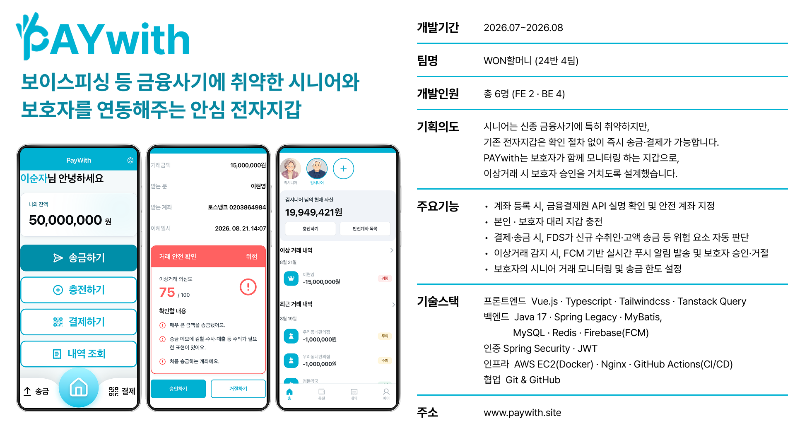

<p align="center">
  
</p>

# PAY-WITH

고령층 사용자의 독립적인 금융 생활을 돕고, 보호자에게는 필요한 순간의 확인과 안심을 제공하는 금융 서비스입니다. 간편한 송금·결제·충전 경험과 이상 거래 탐지, 보호자 승인, 안심 계좌 관리 기능을 제공합니다.

## 프로젝트 구조

```text
PAY-WITH/
├── be/                         # Spring MVC 기반 백엔드
│   ├── src/main/java/com/paywith/
│   │   ├── <domain>/            # 도메인별 controller, service, mapper, domain, dto
│   │   ├── common/              # 공통 응답·유틸리티
│   │   ├── config/              # 애플리케이션 설정
│   │   ├── exception/           # 예외 처리
│   │   └── security/            # JWT·Spring Security
│   └── src/main/resources/
│       ├── db/migration/        # Flyway 마이그레이션·시드
│       └── mappers/             # MyBatis XML 매퍼
├── fe/                         # pnpm·Turborepo 모노레포
│   ├── apps/web/                # Vue 3 사용자 웹 애플리케이션
│   │   ├── src/{api,components,composables,pages,router,schemas,stores}/
│   │   └── tests/{unit,e2e}/
│   ├── apps/storybook/          # UI 컴포넌트 문서화
│   └── packages/ui/             # 재사용 UI 컴포넌트 패키지
└── docs/images/readme/          # README 이미지 자산
```

## 기술 스택

### Backend

| 구분 | 기술 |
| --- | --- |
| Language | Java 17 |
| Framework | Spring Framework 5.3, Spring Security 5.8 |
| Persistence | MyBatis, MySQL, HikariCP |
| Migration | Flyway |
| Authentication | JWT (JJWT) |
| Cache | Redis, Lettuce |
| External service | Firebase Cloud Messaging, Sentry |
| API documentation | Swagger (Springfox) |
| Test | JUnit 5, Mockito, AssertJ, JaCoCo |
| Build | Gradle, WAR |

### Frontend

| 구분 | 기술 |
| --- | --- |
| Framework | Vue 3, TypeScript, Vite |
| Monorepo | pnpm workspace, Turborepo |
| Styling | Tailwind CSS |
| State & Server state | Pinia, TanStack Query |
| Validation | Zod, VeeValidate |
| UI | Reka UI, Lucide, Phosphor Icons |
| PWA & Push | vite-plugin-pwa, Firebase |
| Test | Vitest, Vue Test Utils, Playwright |
| Component documentation | Storybook, Chromatic |

## 주요 기능

- 사용자와 보호자 간 페어링 및 역할별 화면 제공
- 송금, QR 결제, 충전과 거래 내역 조회
- 이상 금융 거래 탐지(FDS) 및 보호자 승인 요청
- 안심 계좌 등록·관리와 보호자 거래 모니터링
- FCM 기반 알림 및 JWT 기반 인증

## Git Convention

### 브랜치

기능 브랜치는 `develop`에서 만들고, 다음 형식을 사용합니다.

```text
[개발 파트]접두어/기능명
```

```text
be/feat/transaction-form
fe/fix/date-filter
```

### 접두어

| 접두어 | 설명 |
| --- | --- |
| `feat` | 기능 개발 |
| `refac` | 리팩터링 |
| `chore` | 기타 환경 설정 |
| `docs` | 문서 |
| `style` | 프론트엔드 스타일 |
| `fix` | 버그 수정 |
| `hotfix` | 핫픽스 |
| `revert` | 변경 되돌리기 |
| `ai` | AI 관련 설정 |

### 커밋과 Pull Request

커밋 메시지와 PR 제목은 같은 형식을 사용합니다.

```text
[개발 파트]접두어: 기능명
```

```text
[be]feat: 로그인 API 연동
[fe]fix: 날짜 필터 수정
```

- 개발 파트는 `fe` 또는 `be`를 사용합니다.
- 기능 PR은 기능 브랜치에서 `develop`으로 생성하고 squash merge 합니다.
- 최소 1명의 리뷰어 승인 후 병합합니다.
- `develop`에서 `main`으로 릴리스할 때는 rebase merge 합니다.

## 프로젝트 요약

<p align="center">
  
</p>
