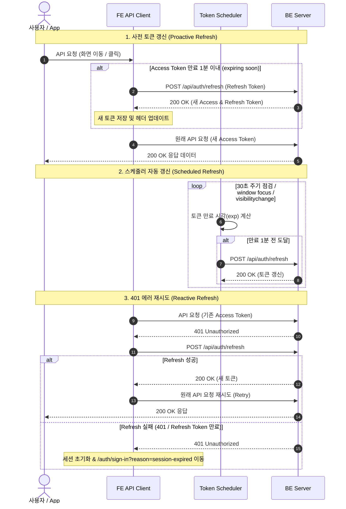

# 🔐 FE 인증 세션 관리 및 토큰 재발급 플로우

이 문서는 PAY-WITH 프론트엔드(FE) 앱에서 사용자 인증 세션과 JWT 토큰(Access Token / Refresh Token)이 어떻게 수명주기(Lifecycle) 동안 유지·갱신·만료 처리되는지 한눈에 파악할 수 있도록 작성되었습니다.

---

## 📌 1. 핵심 요약 (Executive Summary)

- **끊김 없는 UX (Seamless UX)**: 사용자가 앱을 적극적으로 사용하는 동안(API 호출, 화면 이동, 탭 포커스) 토큰 만료 1분 전에 백그라운드에서 선제적(Proactive)으로 토큰을 재발급하여 **사용 중 갑자기 로그아웃되는 현상을 방지**합니다.
- **안전한 세션 만료 (Safe Expiration)**: Refresh Token까지 완전히 만료되었거나 거절(401)된 경우에만 인증 정보를 안전하게 초기화하고, 로그인 화면으로 이동시켜 안내합니다.
- **장애 내구성 (Fault Tolerance)**: 일시적인 네트워크 장애나 서버 5xx 오류 발생 시에는 세션을 바로 강제 종료하지 않고 기존 화면을 유지한 채 재시도합니다.

---

## 🗝️ 2. 토큰 보관 및 세션 구조

| 항목              | 보관 위치                       | 설명                                                     |
| :---------------- | :------------------------------ | :------------------------------------------------------- |
| **Access Token**  | `localStorage` (`accessToken`)  | API 요청 시 `Authorization: Bearer <token>` 헤더에 포함  |
| **Refresh Token** | `localStorage` (`refreshToken`) | Access Token 만료 시 토큰 재발급(`/auth/refresh`)에 사용 |
| **세션 상태**     | `Pinia` / `sessionStorage`      | 앱 실행 중 메모리에 보관되며, 세션 만료 시 초기화됨      |

---

## 🔄 3. 인증 및 토큰 재발급 플로우 Diagram

### 3.1 토큰 재발급 3중 방어막 (Triple Guarding)

FE는 아래의 **3중 방어 메커니즘**을 통해 인증 세션을 안정적으로 유지합니다:

---

## 📋 4. 각 상태별 세부 처리 규칙

### ① 로그인 성공 시

- 백엔드로부터 `accessToken`과 `refreshToken`을 수신받아 `localStorage`에 저장합니다.
- 토큰의 `exp` (만료 시각)를 해석하여 **만료 1분 전** 타이머 스케줄러를 등록합니다.

### ② API 요청 직전 사전 갱신 (Proactive Refresh)

- 모든 API 요청 전 `beforeRequest` 훅이 작동합니다.
- Access Token의 남은 유효기간이 1분 이내이면서 Refresh Token이 존재하는 경우, **백엔드로 요청을 보내기 직전에 미리 `/auth/refresh`를 호출**하여 갱신받은 뒤 최신 토큰으로 헤더를 설정합니다.
- **예외 흐름**: 만약 사전 갱신 중 오류가 발생하더라도(네트워크 타임아웃 등), 에러를 삼키고 기존 토큰으로 본 요청을 시도합니다. 본 요청이 백엔드에서 401 응답을 수신하는 경우 `beforeRetry` 훅에서 세션 만료 및 재시도 처리를 수행합니다.
- **효과**: 서버에서 401 에러가 터지고 이를 복구하는 지연 시간을 감수할 필요 없이 대부분의 상황에서 항상 유효한 토큰으로 요청이 전송됩니다.

### ③ 백그라운드 스케줄러 및 주기적 헬스체크

- 브라우저 탭이 활성화되어 있거나 포커스를 얻을 때(`window.onfocus`, `visibilitychange`), 그리고 **30초 간격의 백그라운드 Interval**을 통해 주기적으로 토큰 만료 시각을 점검합니다.
- 사용자가 한 페이지에 오래 체류(예: QR 결제 화면, 홈 잔액 대기)하더라도 토큰 만료 1분 전에 백그라운드에서 자동으로 갱신됩니다.
- 무분별한 타이머 리셋(Clear & Reset)을 방지하여 라우팅 이동 시 타이머 밀림 현상을 차단했습니다.

### ④ 401 Unauthorized 및 갱신 재시도 (Reactive Retry)

- 만약 시각 오차나 순간적인 타이밍 이슈로 백엔드에서 401 응답을 수신하더라도, `ky` 인터셉터의 `beforeRetry` 훅이 동작하여 `/auth/refresh`를 1회 호출하고 성공 시 원래 요청을 자동 재시도합니다.
- 여러 API가 동시에 401을 받아도 `/auth/refresh` 요청은 **단 1회만 발화(In-flight Promise 공유)**됩니다.

### ⑤ 세션 만료 처리 (Session Expiration)

- Refresh Token이 만료되었거나, 서버로부터 `/auth/refresh`에 대해 401 응답을 수신한 경우:
  1. `localStorage`의 모든 토큰 삭제 (`clearTokens`)
  2. 이전 사용자의 메모리 상태 오염 방지를 위해 앱 세션 초기화
  3. `/auth/sign-in?reason=session-expired&redirect=<이전페이지>`로 이동
  4. 로그인 화면 상단에 **"로그인 시간이 만료되었습니다. 다시 로그인해 주세요."** 안내 메시지 노출

### ⑥ 사용자 명시적 로그아웃 및 회원탈퇴 (Logout & Withdrawal)

사용자가 마이페이지에서 **로그아웃** 또는 **회원탈퇴**를 직접 실행한 경우 다음과 같이 깨끗하게 세션을 정돈합니다:

1. **저장된 토큰 및 브라우저 세션 삭제**:
   - `clearAuthenticationSession()`을 통해 `localStorage`의 `accessToken`, `refreshToken` 및 `sessionStorage`를 모두 비웁니다.
2. **인메모리 API 캐시 완전 초기화 (`queryClient.clear()`)**:
   - TanStack Query의 API 데이터 캐시를 완전히 비워, 로그아웃 후 다른 사용자 로그인 시 이전 사용자의 데이터가 메모리에 남아 노출되지 않도록 차단합니다.
3. **안전한 로그인 화면 이동**:
   - `router.replace({ name: 'auth-sign-in' })`로 뒤로가기 히스토리를 덮어씌워 로그인 화면으로 이동시킵니다.
4. **회원탈퇴 추가 처리**:
   - 회원탈퇴 API (`DELETE /api/users/{userId}`) 호출 성공 후 동일한 세션 정리 절차를 수행합니다.

---

## 💻 5. BE 개발자를 위한 참고 사항 (API 계약)

1. **토큰 재발급 엔드포인트**: `POST /api/auth/refresh`
   - **Request**: `{ "refreshToken": "string" }`
   - **Response**: `ApiResponse<{ "accessToken": "string", "refreshToken": "string", "tokenType": "Bearer" }>`
2. **Token Rotation (토큰 회전)**:
   - FE는 갱신 시 백엔드가 새로 발급해 준 Access Token과 Refresh Token 쌍을 모두 받아 저장합니다.
3. **HTTP Status Code 구분**:
   - `401 Unauthorized`: 실제 토큰 만료 또는 정당하지 않은 세션으로 판정하여 로그인 페이지로 이동합니다.
   - `5xx` / `Network Error`: 서버 일시 장애는 세션 만료로 단정하지 않고 기존 세션을 유지한 채 재시도합니다.

---

## 🎯 6. UX 유의 사항

1. **갑작스러운 로그아웃 없음**: 사용자가 앱을 적극적으로 조작하고 있을 때 갑자기 로그인 화면으로 튕기는 불쾌한 경험이 최소화됩니다.
2. **안전한 재로그인 복귀**: 세션이 만료되어 로그인 페이지로 이동하더라도, 재로그인 성공 시 기존에 보고 있던 화면으로 안전하게 복귀합니다. _(단, 송금·결제 등 중간 입력 상태 복원이 위험한 금융 도메인 절차는 안전을 위해 역할별 홈 화면으로 이동합니다.)_
