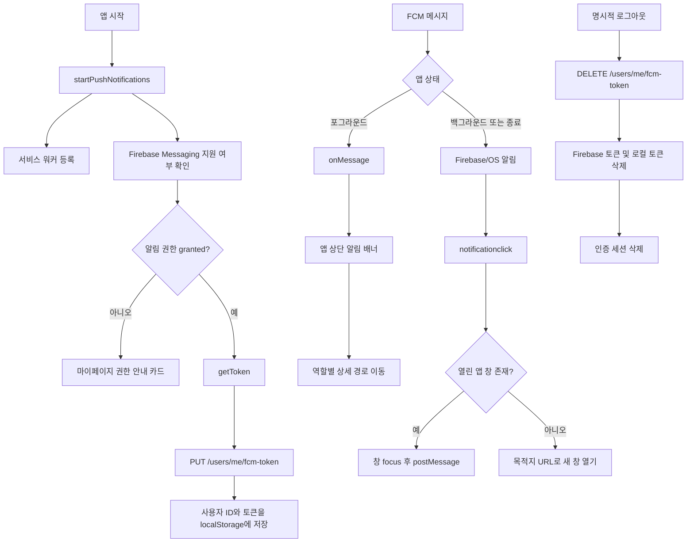

# FE FCM 푸시 알림 구현 및 인수인계

이 문서는 [PR #204](https://github.com/7th-It-s-your-life-PJT-24-4/PAY-WITH/pull/204)에서 추가된 백엔드 FCM 발송 기능과 [Issue #206](https://github.com/7th-It-s-your-life-PJT-24-4/PAY-WITH/issues/206)을 기준으로, 프론트엔드에서 어디까지 구현했는지와 후속 작업자가 실제 기능 페이지를 어떻게 연결해야 하는지를 정리한다.

작성 기준 브랜치는 `fe/feat/fcm-push-notification`이며 기준 백엔드 커밋은 PR #204가 병합된 `c5b433b`이다.

---

## 1. 현재 상태 요약

FCM 공통 기반, 토큰 등록·해제, 포그라운드 수신 UI, 백그라운드 서비스 워커, 알림 클릭 경로 계산, 역할 검증, 빌드·배포 환경 변수 전달까지 구현되어 있다.

다만 다음 두 항목은 실제 사용자 흐름을 완성하려면 후속 구현이 필요하다.

1. **로그아웃 상태에서 알림을 눌렀을 때 로그인 후 원래 목적지 복원**
   - 현재 서비스 워커는 목적지 URL을 열지만, 인증 정보가 전혀 없는 경우 라우터가 로그인 페이지로 이동하면서 목적지 정보를 보존하지 않는다.
   - 세션 만료로 이동하는 경우에는 기존 인증 흐름의 `redirect` 쿼리가 동작하지만, 일반적인 비로그인 콜드 스타트에는 적용되지 않는다.
2. **보호자 이상거래(`ANOMALY`) 상세의 `wardId` 확보**
   - 푸시 payload는 거래 ID인 `refId`만 제공한다.
   - 현재 보호자 거래 상세 API는 `wardId`와 `transactionId`를 모두 요구한다.
   - 앱이 완전히 종료된 뒤 알림으로 진입하면 Pinia의 `activeWardId`가 없으므로 `/guard/history/:id?source=push`만으로 상세 조회를 시작할 수 없다.

위 두 항목 외에도 실제 Firebase 프로젝트 값을 적용한 기기 스모크 테스트는 아직 수행하지 않았다.

---

## 2. 구현 커밋

| 커밋      | 내용                                             |
| --------- | ------------------------------------------------ |
| `7f9b137` | `[fe]feat: Firebase PWA 서비스 워커 기반 구성`   |
| `631e2c9` | `[fe]feat: FCM 토큰 API 및 수명주기 연동`        |
| `dfb373b` | `[fe]feat: 푸시 알림 수신과 역할별 라우팅`       |
| `d7238cf` | `[fe]chore: FCM 알림 공통 기반 테스트 추가`      |
| `793ada4` | `[fe]chore: Firebase 빌드 환경 변수와 캐시 설정` |

---

## 3. 전체 동작 구조



### 앱 시작

`src/main.ts`가 앱 마운트 후 `startPushNotifications(router)`를 한 번 실행한다.

- 프로덕션에서만 서비스 워커를 등록한다.
- Firebase 환경 변수가 없으면 푸시 기능만 `disabled`가 되고 앱은 정상 기동한다.
- 브라우저가 Firebase Messaging 또는 Notification API를 지원하지 않으면 `unsupported`로 처리한다.
- 라우팅 완료 시마다 로그인 사용자와 권한을 확인해 토큰 동기화를 시도한다.

### 토큰 등록

`src/composables/usePushNotification.ts`의 `syncPushNotificationToken()`이 다음 조건에서 동작한다.

- Firebase Messaging 사용 가능
- 알림 권한이 `granted`
- JWT에서 유효한 사용자 ID를 확인할 수 있음
- 다른 동기화가 진행 중이지 않음

FCM 토큰을 얻은 뒤 `사용자 ID:FCM 토큰` 조합이 현재 세션에서 이미 등록되지 않았을 때만 서버에 PUT 요청을 보낸다. 성공한 토큰은 `localStorage`의 `payWithFcmToken` 키에 사용자 ID와 함께 저장한다.

### 토큰 해제

보호자·피보호자 마이페이지의 명시적 로그아웃은 다음 순서를 따른다.

1. 저장된 FCM 토큰으로 백엔드 DELETE 호출
2. Firebase SDK의 `deleteToken()` 호출
3. 로컬 FCM 토큰 삭제
4. 인증 세션과 TanStack Query 캐시 삭제
5. 로그인 페이지 이동

백엔드 또는 Firebase 토큰 해제에 실패해도 로컬 로그아웃은 완료한다. 백엔드 DELETE는 Access Token이 필요한 요청이므로 반드시 인증 세션 삭제보다 먼저 호출한다.

회원탈퇴는 사용자 삭제 API 성공 후 백엔드 FCM 토큰 해제 요청을 다시 보내지 않고 로컬 Firebase 구독만 정리한다. 백엔드가 사용자 삭제 과정에서 저장된 토큰을 함께 제거하기 때문이다.

---

## 4. 백엔드 API 계약

API base URL에는 이미 `/api`가 포함되므로 FE 함수에서는 `/users/me/fcm-token`만 사용한다.

### 토큰 등록

```http
PUT /api/users/me/fcm-token
Authorization: Bearer <access-token>
Content-Type: application/json

{
  "fcmToken": "..."
}
```

### 토큰 해제

```http
DELETE /api/users/me/fcm-token
Authorization: Bearer <access-token>
Content-Type: application/json

{
  "fcmToken": "..."
}
```

두 응답 모두 다음 계약으로 파싱한다.

```json
{
  "success": true,
  "data": null,
  "message": "..."
}
```

`fcmToken`은 백엔드 DTO의 `@NotBlank`, `@Size(max = 255)`와 동일하게 FE Zod에서도 trim 후 1~255자로 검증한다.

DELETE 요청에도 토큰 본문이 필요하다. 다른 기기에서 새 토큰이 등록된 뒤 이전 기기의 늦은 로그아웃이 새 기기의 토큰을 지우지 않도록, 백엔드는 현재 등록된 토큰과 요청 토큰이 일치할 때만 삭제한다.

관련 파일:

- `src/schemas/fcm-token.schema.ts`
- `src/api/fcm-token.ts`
- `src/api/client.ts`
- `src/api/push-session.ts`
- `src/lib/push-token-storage.ts`

---

## 5. 알림 payload와 현재 라우팅

백엔드는 `notification`에 제목·본문을, `data`에 클릭 대상 식별자를 보낸다. `refId`는 문자열이며 반드시 `refType`과 함께 해석해야 한다.

| `type`             | `refType`     | `refId` 의미 | 대상 역할 | 현재 FE 목적지                                | 실제 페이지 연동 상태                   |
| ------------------ | ------------- | ------------ | --------- | --------------------------------------------- | --------------------------------------- |
| `APPROVAL_REQUEST` | `APPROVAL`    | 승인 요청 ID | `GUARD`   | `/guard/approval-requests/:refId?source=push` | API 조회와 승인·거절까지 연결됨         |
| `ANOMALY`          | `TRANSACTION` | 거래 ID      | `GUARD`   | `/guard/history/:refId?source=push`           | `wardId`가 없으면 콜드 스타트 조회 불가 |
| `APPROVAL_RESULT`  | `TRANSACTION` | 거래 ID      | `WARD`    | `/ward/history/:refId?source=push`            | 거래 ID만으로 API 조회 가능             |

`src/schemas/push-notification.schema.ts`는 위 세 조합만 허용한다. 다음 payload는 화면 이동 없이 무시한다.

- 알 수 없는 `type`
- `type`과 맞지 않는 `refType`
- 누락된 `refId`
- 0, 음수, 숫자가 아닌 `refId`

`src/lib/push-notification.ts`의 `resolvePushNotificationDestination()`가 payload 검증, 역할, 목적지 경로 계산을 담당한다. 포그라운드와 서비스 워커가 같은 함수를 사용하므로 새 알림 유형을 추가할 때 이 파일을 단일 기준으로 유지해야 한다.

---

## 6. 포그라운드 수신

앱이 열린 상태에서는 Firebase `onMessage()`가 메시지를 받는다.

1. payload `data`를 공통 Zod 스키마로 검증한다.
2. 유효하면 `foregroundNotification` 상태에 제목·본문·목적지를 저장한다.
3. `App.vue`에 전역 배치된 `PushNotificationBanner.vue`가 상단 배너를 표시한다.
4. 배너 본문을 누르면 목적지로 이동하고, 닫기 버튼을 누르면 배너만 제거한다.

서버가 보낸 제목·본문이 없을 때만 FE 기본 문구를 사용한다.

현재 배너는 마지막 알림 한 건만 보관한다. 알림함이나 여러 알림 큐는 이번 범위가 아니다.

---

## 7. 백그라운드 수신과 서비스 워커

기존 `vite-plugin-pwa`의 `generateSW`를 `injectManifest`로 변경하고 `src/sw.ts` 하나에 Workbox와 Firebase Messaging을 통합했다. 같은 scope에 별도의 PWA SW와 Firebase SW를 동시에 두지 않는다.

서비스 워커의 역할:

- Workbox precache 및 구버전 캐시 정리
- 새 버전 즉시 활성화(`skipWaiting`, `clientsClaim`)
- Firebase background messaging 초기화
- 알림 클릭 처리
- 열린 앱 창 focus 및 `postMessage`
- 열린 앱이 없으면 목적지 URL로 새 창 열기

PR #204의 백엔드는 `notification` payload를 함께 보내므로 백그라운드에서는 Firebase/브라우저가 OS 알림을 자동 표시한다. `onBackgroundMessage()`에서 같은 알림을 다시 표시하면 중복되므로, 현재 코드는 `notification`이 없는 data-only 메시지일 때만 기본 알림을 직접 표시한다.

브라우저가 생성한 알림 클릭 데이터는 환경에 따라 최상위 데이터이거나 `FCM_MSG.data`에 들어올 수 있어 두 형태를 모두 해석한다.

Nginx는 `/sw.js`에 `Cache-Control: no-cache`를 붙인다. 서비스 워커를 장기 캐시하면 새 배포 이후에도 이전 알림 핸들러가 남을 수 있으므로 이 설정을 제거하지 않는다.

관련 파일:

- `vite.config.ts`
- `src/sw.ts`
- `src/lib/service-worker.ts`
- `src/lib/firebase.ts`
- `nginx/default.conf`

---

## 8. 권한 UI와 브라우저별 처리

`PushNotificationPermissionCard.vue`는 현재 보호자·피보호자 마이페이지에 배치되어 있다.

| 상태               | UI 동작                                  |
| ------------------ | ---------------------------------------- |
| `default`          | 설명과 `알림 받기` 버튼 표시             |
| `granted`          | 권한 카드 숨김, 토큰 동기화              |
| `denied`           | 재요청 버튼 없이 브라우저·기기 설정 안내 |
| Firebase 설정 없음 | 푸시 기능 비활성화, 카드 숨김            |
| 미지원 환경        | 미지원 안내 및 iPhone PWA 설치 안내      |
| 토큰 등록 오류     | 재시도 안내 메시지 표시                  |

브라우저 권한 요청은 페이지 로드 시 자동 실행하지 않고 반드시 사용자가 `알림 받기` 버튼을 누른 시점에 실행한다.

iOS Web Push는 Safari 16.4 이상에서 홈 화면에 추가한 PWA로 실행해야 한다. 일반 Safari 탭만으로는 기대한 동작을 보장할 수 없다.

---

## 9. 역할 및 인증 라우팅

푸시 목적지에는 `?source=push`를 붙인다. 전역 라우터 가드는 이 쿼리가 있을 때만 현재 사용자 정보를 조회해 목적지 역할을 검증한다.

- `/guard/**` 푸시 목적지에는 `GUARD`만 접근
- `/ward/**` 푸시 목적지에는 `WARD`만 접근
- 역할이 다르면 현재 사용자의 역할별 홈으로 이동
- 사용자 조회가 401이면 세션을 정리하고 로그인 페이지로 이동
- 일반 페이지 이동에는 추가 사용자 조회를 만들지 않음

### 미완료: 비로그인 목적지 복원

Issue #206의 “로그인 전 알림 클릭을 위한 pending destination 저장 및 로그인 후 복구”는 완전히 구현되지 않았다.

현재 전역 인증 가드는 세션 만료인 경우에만 다음과 같이 목적지를 보존한다.

```text
/auth/sign-in?reason=session-expired&redirect=<원래 푸시 URL>
```

Access Token 자체가 없는 일반 비로그인 상태에서는 `redirect` 없이 로그인 페이지로 이동한다. 후속 구현은 다음 중 한 방식으로 통일해야 한다.

1. 인증 가드가 `source=push` 목적지에 대해 항상 `redirect: to.fullPath`를 로그인 페이지에 전달
2. 검증된 목적지를 `sessionStorage`에 pending destination으로 저장하고 로그인 성공 후 한 번 소비

권장 방식은 기존 로그인 페이지의 `redirect` 검증 로직을 재사용하는 1번이다. 단, 금융 중간 단계 경로는 기존 인증 정책대로 역할별 홈으로 제한하고, 이 문서의 세 가지 읽기·승인 상세 경로만 허용해야 한다.

추가할 테스트:

- 로그아웃 상태에서 세 가지 푸시 URL 진입 시 로그인 페이지에 안전한 `redirect`가 남는지
- 로그인 성공 후 원래 푸시 상세로 돌아가는지
- 다른 역할로 로그인하면 해당 역할 홈으로 이동하는지
- 외부 URL 또는 허용하지 않은 경로를 `redirect`로 넣어도 이동하지 않는지

---

## 10. 실제 기능 페이지 연동 방법

푸시 공통 계층은 목적지까지만 계산한다. 상세 페이지는 URL만으로 새로고침·콜드 스타트가 가능해야 하며, Pinia의 일시 상태나 이전 목록 화면에 의존하면 안 된다.

### 공통 구현 원칙

1. 라우트 파라미터를 양의 정수로 검증한다.
2. URL에 있는 식별자만으로 상세 API를 호출한다.
3. 로딩, 조회 실패, 404·409 등 이미 처리되거나 만료된 상태를 화면에서 분리한다.
4. 목록 화면을 거치지 않고 직접 진입해도 필요한 데이터를 모두 조회한다.
5. `source=push`는 인증·역할 검증과 뒤로가기 UX에만 사용하고, 도메인 ID로 사용하지 않는다.
6. 승인·거절 등 mutation 성공 후 관련 목록과 홈 Query를 invalidate한다.
7. 뒤로갈 히스토리가 없는 콜드 스타트를 고려해 명시적인 fallback 경로를 둔다.

### `APPROVAL_REQUEST` → 보호자 승인 상세

현재 `/guard/approval-requests/:id` 페이지는 `approvalId`만으로 상세 API를 조회하고 승인·거절 mutation까지 수행한다. 푸시 직접 진입에 필요한 기본 연동은 완료되어 있다.

후속 점검 사항:

- 이미 처리되거나 만료된 요청에 대한 404·409 UI 문구 확인
- 푸시 콜드 스타트에서 뒤로가기 시 승인 요청 목록으로 이동하는지 확인
- 승인·거절 후 홈과 승인 목록 캐시가 갱신되는지 실기기 확인

### `ANOMALY` → 보호자 거래 상세

현재 `/guard/history/:id` 페이지는 다음 API를 사용한다.

```text
GET /api/guard/wards/:wardId/transactions/:transactionId
```

하지만 FCM payload에는 `transactionId`만 있고 `wardId`가 없다. 페이지는 쿼리의 `wardId` 또는 `guardStore.activeWardId`를 사용하므로 콜드 스타트에서 조회가 막힌다.

이 문제는 FE에서 임의로 ward를 추정하지 말고 API 계약을 확정해 해결해야 한다. 선택지는 다음과 같다.

1. 백엔드가 보호자 본인 소유권을 검사하는 `GET /api/guard/transactions/:transactionId` 상세 API 제공
2. FCM payload에 `wardId`를 추가하고 Zod 스키마·목적지 URL도 함께 확장
3. 거래 ID로 소속 ward를 조회하는 별도 API 제공

가장 단순한 사용자 흐름은 1번이다. 2번을 선택하면 PR #204의 payload 계약 변경이 필요하고 기존 알림과의 하위 호환 정책도 정해야 한다.

해결 후 다음을 추가해야 한다.

- 콜드 스타트에서도 상세 API가 호출되는 단위·E2E 테스트
- 보호자에게 속하지 않은 거래 ID 접근 차단 검증
- 거래가 삭제되거나 조회 불가능할 때 목록 또는 홈 fallback

### `APPROVAL_RESULT` → 피보호자 거래 상세

현재 `/ward/history/:transactionId` 페이지는 다음 API를 사용한다.

```text
GET /api/ward/transactions/:transactionId
```

사용자 ID는 인증 토큰에서 판단하므로 URL의 거래 ID만으로 직접 조회할 수 있다. 푸시 연동에 적합한 구조다.

후속 점검 사항:

- 승인 완료, 승인 후 실패, 결과 불명, 거절 상태별 카드와 문구 확인
- 존재하지 않거나 다른 사용자의 거래 ID 접근 시 오류 UI 확인
- 콜드 스타트에서 `window.history`가 짧을 때 거래 목록 fallback 확인

### 새 알림 유형을 추가하는 순서

1. 백엔드의 `type`, `refType`, `refId` 의미와 대상 역할을 먼저 확정한다.
2. `push-notification.schema.ts`의 discriminated union에 정확한 조합을 추가한다.
3. `resolvePushNotificationDestination()`에 대상 역할과 직접 진입 가능한 경로를 추가한다.
4. 상세 페이지가 URL 식별자만으로 API를 조회하는지 확인한다.
5. payload 유효·무효 조합 단위 테스트를 추가한다.
6. 포그라운드 배너 클릭, 열린 앱의 OS 알림 클릭, 앱 종료 상태 클릭을 각각 검증한다.
7. 로그인·로그아웃 및 역할 불일치 상태를 함께 검증한다.

---

## 11. 환경 변수와 배포

필요한 FE 공개 설정은 다음과 같다.

```dotenv
VITE_FIREBASE_API_KEY=
VITE_FIREBASE_AUTH_DOMAIN=
VITE_FIREBASE_PROJECT_ID=
VITE_FIREBASE_STORAGE_BUCKET=
VITE_FIREBASE_MESSAGING_SENDER_ID=
VITE_FIREBASE_APP_ID=
VITE_FIREBASE_VAPID_KEY=
```

설정 위치:

- 로컬 예시: `fe/apps/web/.env.example`
- EC2 수동 빌드 예시: `deploy/.env.example`
- Docker build args: `fe/Dockerfile`
- Compose build args: `deploy/docker-compose.ec2.yml`
- CI 이미지 빌드: `.github/workflows/fe-ci-cd.yml`의 GitHub Repository Variables

GitHub에는 위 이름과 동일한 Repository Variable을 등록해야 한다. Vite 환경 변수는 런타임이 아니라 **이미지 빌드 시점에 번들에 포함**되므로, 값을 바꾼 뒤에는 FE 이미지를 다시 빌드·배포해야 한다.

Firebase Web config와 VAPID 공개키는 브라우저 번들에 포함되는 공개 식별자다. 다음 값은 FE 환경 변수, 저장소, Docker 이미지에 절대 포함하지 않는다.

- Firebase 서비스 계정 JSON
- 서비스 계정 private key
- VAPID private key

백엔드 서비스 계정은 EC2의 `deploy/secrets/firebase-service-account.json`에만 두고 Compose가 읽기 전용으로 마운트한다.

---

## 12. 테스트 및 검증 상태

구현 후 확인한 결과:

- `pnpm install --frozen-lockfile`: 통과
- `pnpm lint`: 통과
- `pnpm build`: 통과
  - `injectManifest`가 `dist/sw.js`를 생성하는 것 확인
  - Workbox precache manifest 주입 확인
- `pnpm test`: 통과
  - web 248개
  - UI 30개
  - 합계 278개
- `git diff --check`: 통과

추가된 주요 단위 테스트:

- FCM 토큰 요청·응답 스키마와 최대 길이
- DELETE JSON body 전달
- payload 조합 및 역할별 경로 계산
- 로그아웃 시 서버 토큰 해제와 로컬 정리 순서
- 권한 상태별 토큰 발급·등록
- 권한 안내 카드 상태별 렌더링

### E2E 및 실기기 검증 상태

전체 Playwright 실행에서는 FCM과 무관한 기존 사용자 플로우 5건이 남아 전체 green 상태가 아니다.

- 페어링 보호자 이름 노출
- 피보호자 신규 충전 계좌
- 피보호자 결제 성공
- 피보호자 결제 실패
- 피보호자 거래 내역 실패 상태

FCM 변경으로 영향을 받았던 마이페이지 관련 실패는 개발 환경에서 서비스 워커 등록을 막은 뒤 통과했다. 서비스 워커는 현재 `import.meta.env.PROD`일 때만 등록한다.

아직 수행하지 않은 검증:

- 실제 Firebase Web config와 VAPID 키를 적용한 토큰 발급
- 실제 Android Chrome 백그라운드·종료 상태 알림
- 실제 iOS 홈 화면 PWA 알림
- 앱이 열린 상태의 실제 FCM 포그라운드 배너
- 서로 다른 역할·로그인 상태의 실제 알림 클릭
- 토큰이 무효화·회전된 뒤 재등록되는 장시간 세션

---

## 13. 리뷰 체크리스트

- [ ] 서비스 계정 정보나 private key가 FE 번들 또는 Git 이력에 없는가
- [ ] Firebase 설정이 비어 있어도 로컬 앱이 정상 기동하는가
- [ ] 권한 팝업은 사용자 클릭 뒤에만 열리는가
- [ ] `denied` 상태에서 무의미한 재요청을 하지 않는가
- [ ] 로그인 후 PUT 요청에 현재 사용자의 Access Token이 포함되는가
- [ ] 로그아웃 시 DELETE가 인증 세션 삭제보다 먼저 실행되는가
- [ ] DELETE 실패에도 로컬 로그아웃이 완료되는가
- [ ] 포그라운드에서 서버 제목·본문이 배너에 표시되는가
- [ ] 백그라운드 알림이 중복 표시되지 않는가
- [ ] 잘못된 payload가 라우팅을 일으키지 않는가
- [ ] 다른 역할의 푸시 목적지를 열면 역할별 홈으로 이동하는가
- [ ] 앱 종료 상태에서 로그인 후 원래 목적지가 복원되는가
- [ ] 보호자 `ANOMALY` 상세가 Pinia 상태 없이도 열리는가
- [ ] `/sw.js`가 `no-cache`로 응답하는가
- [ ] Firebase 변수를 변경한 뒤 FE 이미지를 재빌드했는가

---

## 14. 권장 후속 작업 순서

1. 비로그인 푸시 목적지의 안전한 `redirect` 보존 및 로그인 후 복구
2. 보호자 `ANOMALY` 상세의 `wardId` 의존성 제거 또는 payload/API 계약 확장
3. 위 두 흐름의 라우터 단위 테스트와 Playwright 직접 진입 테스트 추가
4. GitHub Repository Variables에 실제 Firebase Web config와 VAPID 공개키 등록
5. 개발용 Firebase 프로젝트에서 Android Chrome 실기기 스모크 테스트
6. iOS Safari 16.4 이상 홈 화면 PWA 스모크 테스트
7. 운영 배포 후 `/sw.js` 캐시 헤더, 토큰 PUT/DELETE, 세 가지 실제 발송 경로 확인

이 순서를 완료해야 Issue #206의 “로그인 전 클릭 복구”와 “HTTPS/PWA 환경 실제 동작”까지 포함해 공통 기반을 최종 완료로 판단할 수 있다.
