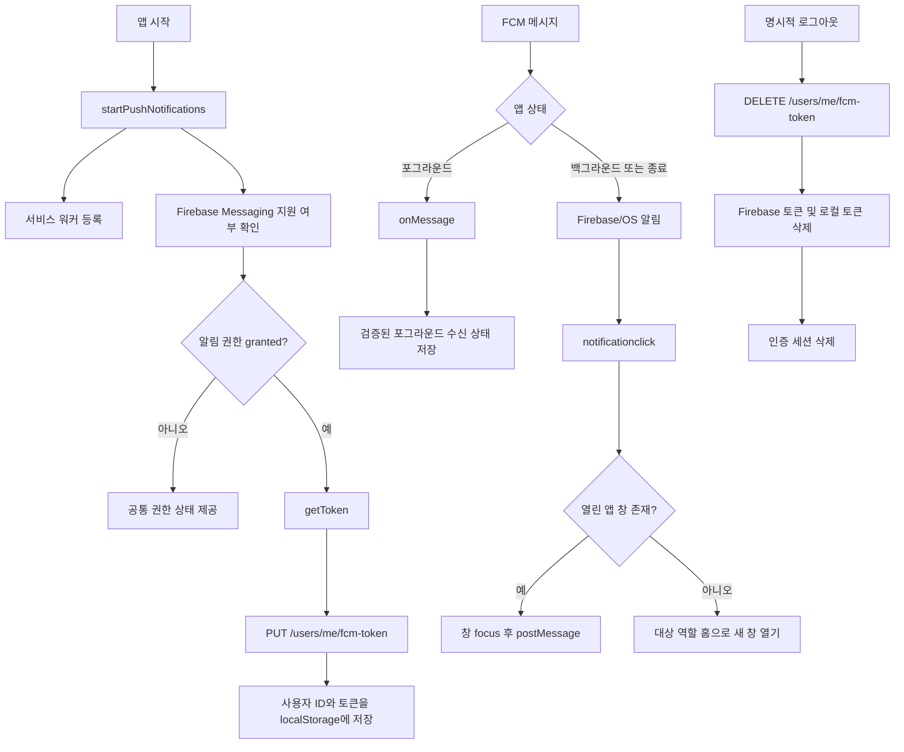

# FE FCM 푸시 알림 구현 및 인수인계

이 문서는 [PR #204](https://github.com/7th-It-s-your-life-PJT-24-4/PAY-WITH/pull/204)에서 추가된 백엔드 FCM 발송 기능과 [Issue #206](https://github.com/7th-It-s-your-life-PJT-24-4/PAY-WITH/issues/206)을 기준으로, 프론트엔드에서 어디까지 구현했는지와 후속 작업자가 실제 기능 페이지를 어떻게 연결해야 하는지를 정리한다.

작성 기준 브랜치는 `fe/feat/fcm-push-notification`이며 기준 백엔드 커밋은 PR #204가 병합된 `c5b433b`이다.

---

## 1. 현재 상태 요약

Issue #206 범위인 FCM 공통 기반, 토큰 등록·해제, 포그라운드 수신 상태, 백그라운드 서비스 워커, payload 검증, 역할 검증, 로그인 후 안전한 복구, 빌드·배포 환경 변수 전달까지 구현되어 있다.

Issue #207·#208의 책임인 사용자 노출용 포그라운드 알림 UI, 역할별 화면의 권한 UI 장착, 승인·거래 상세 직접 진입, 알림 유형별 UX는 구현하지 않았다. 클릭 시에는 검증된 대상 역할의 홈까지만 이동하며, 원본 `type`, `refType`, `refId`는 후속 라우팅 구현에서 사용할 수 있도록 공통 계층이 유지한다. 백엔드 payload 계약도 PR #204 상태에서 변경하지 않았다.

실제 Firebase 프로젝트 값을 적용한 기기 스모크 테스트는 아직 수행하지 않았다.

---

## 2. 구현 커밋

| 커밋      | 내용                                             |
| --------- | ------------------------------------------------ |
| `7f9b137` | `[fe]feat: Firebase PWA 서비스 워커 기반 구성`   |
| `631e2c9` | `[fe]feat: FCM 토큰 API 및 수명주기 연동`        |
| `dfb373b` | `[fe]feat: 푸시 알림 수신과 역할별 라우팅`       |
| `d7238cf` | `[fe]chore: FCM 알림 공통 기반 테스트 추가`      |
| `793ada4` | `[fe]chore: Firebase 빌드 환경 변수와 캐시 설정` |

---

## 3. 전체 동작 구조



### 앱 시작

`src/main.ts`가 앱 마운트 후 `startPushNotifications(router)`를 한 번 실행한다.

- 프로덕션에서만 서비스 워커를 등록한다.
- Firebase 환경 변수가 없으면 푸시 기능만 `disabled`가 되고 앱은 정상 기동한다.
- 브라우저가 Firebase Messaging 또는 Notification API를 지원하지 않으면 `unsupported`로 처리한다.
- 라우팅 완료 시마다 로그인 사용자와 권한을 확인해 토큰 동기화를 시도한다.

### 토큰 등록

`src/composables/usePushNotification.ts`의 `syncPushNotificationToken()`이 다음 조건에서 동작한다.

- Firebase Messaging 사용 가능
- 알림 권한이 `granted`
- JWT에서 유효한 사용자 ID를 확인할 수 있음
- 다른 동기화가 진행 중이지 않음

FCM 토큰을 얻은 뒤 `사용자 ID:FCM 토큰` 조합이 현재 세션에서 이미 등록되지 않았을 때만 서버에 PUT 요청을 보낸다. 성공한 토큰은 `localStorage`의 `payWithFcmToken` 키에 사용자 ID와 함께 저장한다.

### 토큰 해제

보호자·피보호자 마이페이지의 명시적 로그아웃은 다음 순서를 따른다.

1. 저장된 FCM 토큰으로 백엔드 DELETE 호출
2. Firebase SDK의 `deleteToken()` 호출
3. 로컬 FCM 토큰 삭제
4. 인증 세션과 TanStack Query 캐시 삭제
5. 로그인 페이지 이동

백엔드 또는 Firebase 토큰 해제에 실패해도 로컬 로그아웃은 완료한다. 백엔드 DELETE는 Access Token이 필요한 요청이므로 반드시 인증 세션 삭제보다 먼저 호출한다.

Access Token 만료나 API 401로 세션이 강제 종료될 때는 이미 인증 요청을 보낼 수 없으므로 서버 DELETE를 시도하지 않는다. 대신 로그인 페이지로 이동하기 전에 Firebase `deleteToken()`과 로컬 토큰·동기화 상태를 정리해 공용 기기에서 이전 사용자의 알림이 계속 노출되지 않게 한다.

회원탈퇴는 사용자 삭제 API 성공 후 백엔드 FCM 토큰 해제 요청을 다시 보내지 않고 로컬 Firebase 구독만 정리한다. 백엔드가 사용자 삭제 과정에서 저장된 토큰을 함께 제거하기 때문이다.

---

## 4. 백엔드 API 계약

API base URL에는 이미 `/api`가 포함되므로 FE 함수에서는 `/users/me/fcm-token`만 사용한다.

### 토큰 등록

```http
PUT /api/users/me/fcm-token
Authorization: Bearer <access-token>
Content-Type: application/json

{
  "fcmToken": "..."
}
```

### 토큰 해제

```http
DELETE /api/users/me/fcm-token
Authorization: Bearer <access-token>
Content-Type: application/json

{
  "fcmToken": "..."
}
```

두 응답 모두 다음 계약으로 파싱한다.

```json
{
  "success": true,
  "data": null,
  "message": "..."
}
```

`fcmToken`은 백엔드 DTO의 `@NotBlank`, `@Size(max = 255)`와 동일하게 FE Zod에서도 trim 후 1~255자로 검증한다.

DELETE 요청에도 토큰 본문이 필요하다. 다른 기기에서 새 토큰이 등록된 뒤 이전 기기의 늦은 로그아웃이 새 기기의 토큰을 지우지 않도록, 백엔드는 현재 등록된 토큰과 요청 토큰이 일치할 때만 삭제한다.

관련 파일:

- `src/schemas/fcm-token.schema.ts`
- `src/api/fcm-token.ts`
- `src/api/client.ts`
- `src/api/push-session.ts`
- `src/lib/push-token-storage.ts`

---

## 5. 알림 payload와 공통 라우팅

백엔드는 `notification`에 제목·본문을, `data`에 클릭 대상 식별자를 보낸다. `refId`는 문자열이며 반드시 `refType`과 함께 해석해야 한다.

| `type`             | `refType`     | `refId` 의미 | 대상 역할 | #206 현재 목적지     | 상세 연동 이슈 |
| ------------------ | ------------- | ------------ | --------- | -------------------- | -------------- |
| `APPROVAL_REQUEST` | `APPROVAL`    | 승인 요청 ID | `GUARD`   | `/guard?source=push` | #207           |
| `ANOMALY`          | `TRANSACTION` | 거래 ID      | `GUARD`   | `/guard?source=push` | #207           |
| `APPROVAL_RESULT`  | `TRANSACTION` | 거래 ID      | `WARD`    | `/ward?source=push`  | #208           |

`src/schemas/push-notification.schema.ts`는 위 세 조합만 허용한다. 다음 payload는 화면 이동 없이 무시한다.

- 알 수 없는 `type`
- `type`과 맞지 않는 `refType`
- 누락된 `refId`
- 0, 음수, 숫자가 아닌 `refId`

`src/lib/push-notification.ts`의 `resolvePushNotificationDestination()`가 payload 검증과 대상 역할의 안전한 홈 경로 계산을 담당한다. 상세 경로는 #207·#208에서 연결한다. 포그라운드와 서비스 워커가 같은 함수를 사용하므로 새 알림 유형을 추가할 때 이 파일을 단일 기준으로 유지해야 한다.

---

## 6. 포그라운드 수신

앱이 열린 상태에서는 Firebase `onMessage()`가 메시지를 받는다.

1. payload `data`를 공통 Zod 스키마로 검증한다.
2. 유효하면 `foregroundNotification` 상태에 제목·본문·대상 역할 홈을 저장한다.
3. 공통 composable이 이 상태를 제공한다.

현재 `App.vue`나 역할별 페이지에는 이 상태를 표시하는 UI가 연결되어 있지 않다. #207은 보호자 승인 요청 CTA와 이상거래 UX를, #208은 피보호자 송금 결과 UI를 각각 구현해야 한다.

서버가 보낸 제목·본문이 없을 때만 FE 기본 문구를 사용한다.

공통 상태는 마지막 알림 한 건만 보관한다. 알림함이나 여러 알림 큐는 이번 범위가 아니다.

---

## 7. 백그라운드 수신과 서비스 워커

기존 `vite-plugin-pwa`의 `generateSW`를 `injectManifest`로 변경하고 `src/sw.ts` 하나에 Workbox와 Firebase Messaging을 통합했다. 같은 scope에 별도의 PWA SW와 Firebase SW를 동시에 두지 않는다.

서비스 워커의 역할:

- Workbox precache 및 구버전 캐시 정리
- 새 버전 즉시 활성화(`skipWaiting`, `clientsClaim`)
- Firebase background messaging 초기화
- 알림 클릭 처리
- 열린 앱 창 focus 및 `postMessage`
- 열린 앱이 없으면 목적지 URL로 새 창 열기

PR #204의 백엔드는 `notification` payload를 함께 보내므로 권한이 허용된 브라우저에서는 Firebase SDK가 OS 알림을 처리한다. FE 서비스 워커는 Firebase Messaging 초기화와 클릭 전달 기반만 제공하며, data-only 메시지에 대한 커스텀 `showNotification()` UI는 구현하지 않았다.

브라우저가 생성한 알림 클릭 데이터는 환경에 따라 최상위 데이터이거나 `FCM_MSG.data`에 들어올 수 있어 두 형태를 모두 해석한다.

Nginx는 `/sw.js`에 `Cache-Control: no-cache`를 붙인다. 서비스 워커를 장기 캐시하면 새 배포 이후에도 이전 알림 핸들러가 남을 수 있으므로 이 설정을 제거하지 않는다.

관련 파일:

- `vite.config.ts`
- `src/sw.ts`
- `src/lib/service-worker.ts`
- `src/lib/firebase.ts`
- `nginx/default.conf`

---

## 8. 권한 UI와 브라우저별 처리

`PushNotificationPermissionCard.vue`는 권한 상태별 공통 UI로 준비되어 있지만 보호자·피보호자 페이지에는 배치하지 않았다. 실제 노출 위치와 역할별 문구는 #207·#208에서 결정한다.

| 상태               | UI 동작                                  |
| ------------------ | ---------------------------------------- |
| `default`          | 설명과 `알림 받기` 버튼 표시             |
| `granted`          | 권한 카드 숨김, 토큰 동기화              |
| `denied`           | 재요청 버튼 없이 브라우저·기기 설정 안내 |
| Firebase 설정 없음 | 푸시 기능 비활성화, 카드 숨김            |
| 미지원 환경        | 미지원 안내 및 iPhone PWA 설치 안내      |
| 토큰 등록 오류     | 재시도 안내 메시지 표시                  |

브라우저 권한 요청은 페이지 로드 시 자동 실행하지 않고 반드시 사용자가 `알림 받기` 버튼을 누른 시점에 실행한다.

iOS Web Push는 Safari 16.4 이상에서 홈 화면에 추가한 PWA로 실행해야 한다. 일반 Safari 탭만으로는 기대한 동작을 보장할 수 없다.

---

## 9. 역할 및 인증 라우팅

푸시 목적지에는 `?source=push`를 붙인다. 전역 라우터 가드는 이 쿼리가 있을 때만 현재 사용자 정보를 조회해 목적지 역할을 검증한다.

- `/guard/**` 푸시 목적지에는 `GUARD`만 접근
- `/ward/**` 푸시 목적지에는 `WARD`만 접근
- 역할이 다르면 현재 사용자의 역할별 홈으로 이동
- 사용자 조회가 401이면 세션을 정리하고 로그인 페이지로 이동
- 일반 페이지 이동에는 추가 사용자 조회를 만들지 않음

### 비로그인 목적지 복원

Issue #206의 “로그인 전 알림 클릭을 위한 pending destination 저장 및 로그인 후 복구”는 기존 로그인 `redirect` 흐름을 재사용해 구현했다.

세션이 만료된 경우에는 다음과 같이 사유와 목적지를 함께 보존한다.

```text
/auth/sign-in?reason=session-expired&redirect=<원래 푸시 URL>
```

일반 비로그인 상태에서도 `source=push`이면 `/auth/sign-in?redirect=<원래 푸시 URL>`로 이동한다. 로그인 성공 후 `getSafePostLoginPath()`가 다음을 검증한 뒤 목적지를 복구한다.

- 현재 사용자 역할과 같은 `/guard` 또는 `/ward` 내부 경로
- 외부 URL이나 `//`로 시작하지 않는 경로
- 인증 페이지가 아닌 경로
- 결제·송금·충전의 중간 처리 단계가 아닌 경로

다른 역할로 로그인하거나 허용하지 않은 경로이면 역할별 홈으로 이동한다.

---

## 10. #207·#208 실제 기능 페이지 연동 방법

푸시 공통 계층은 payload를 검증하고 대상 역할 홈까지만 계산한다. #207·#208에서 상세 경로를 연결할 때 상세 페이지는 URL만으로 새로고침·콜드 스타트가 가능해야 하며, Pinia의 일시 상태나 이전 목록 화면에 의존하면 안 된다.

### 공통 구현 원칙

1. 라우트 파라미터를 양의 정수로 검증한다.
2. URL에 있는 식별자만으로 상세 API를 호출한다.
3. 로딩, 조회 실패, 404·409 등 이미 처리되거나 만료된 상태를 화면에서 분리한다.
4. 목록 화면을 거치지 않고 직접 진입해도 필요한 데이터를 모두 조회한다.
5. `source=push`는 인증·역할 검증과 뒤로가기 UX에만 사용하고, 도메인 ID로 사용하지 않는다.
6. 승인·거절 등 mutation 성공 후 관련 목록과 홈 Query를 invalidate한다.
7. 뒤로갈 히스토리가 없는 콜드 스타트를 고려해 명시적인 fallback 경로를 둔다.

### `APPROVAL_REQUEST` → 보호자 승인 상세

후속 #207에서 `/guard/approval-requests/:id`로 연결한다. 현재 페이지는 `approvalId`만으로 상세 API를 조회하고 승인·거절 mutation을 수행할 수 있지만, 공통 푸시 계층은 아직 이 경로를 반환하지 않는다.

후속 점검 사항:

- 이미 처리되거나 만료된 요청에 대한 404·409 UI 문구 확인
- 푸시 콜드 스타트에서 뒤로가기 시 승인 요청 목록으로 이동하는지 확인
- 승인·거절 후 홈과 승인 목록 캐시가 갱신되는지 실기기 확인

### `ANOMALY` → 보호자 거래 상세

현재 `/guard/history/:id` 페이지는 다음 API를 사용한다.

```text
GET /api/guard/wards/:wardId/transactions/:transactionId
```

PR #204의 payload에는 `transactionId`만 있고 `wardId`가 없다. 공통 계층은 이를 임의로 추정하지 않고 보호자 홈으로 이동한다. 후속 #207에서는 다음 중 계약을 확정한 뒤 상세 경로를 연결해야 한다.

1. BE가 소유권을 검사하는 거래 ID 단독 상세 API 제공
2. `ANOMALY` payload에 `wardId` 추가
3. 거래 ID로 소속 피보호자를 조회하는 API 제공

계약 확정 전에는 Pinia의 `activeWardId`를 콜드 스타트의 근거로 사용하지 않는다.

### `APPROVAL_RESULT` → 피보호자 거래 상세

현재 `/ward/history/:transactionId` 페이지는 다음 API를 사용한다.

```text
GET /api/ward/transactions/:transactionId
```

사용자 ID는 인증 토큰에서 판단하므로 URL의 거래 ID만으로 직접 조회할 수 있다. 후속 #208에서 `/ward/history/:transactionId` 경로와 유형별 표시 UI를 연결한다.

후속 점검 사항:

- 승인 완료, 승인 후 실패, 결과 불명, 거절 상태별 카드와 문구 확인
- 존재하지 않거나 다른 사용자의 거래 ID 접근 시 오류 UI 확인
- 콜드 스타트에서 `window.history`가 짧을 때 거래 목록 fallback 확인

### 새 알림 유형을 추가하는 순서

1. 백엔드의 `type`, `refType`, `refId` 의미와 대상 역할을 먼저 확정한다.
2. `push-notification.schema.ts`의 discriminated union에 정확한 조합을 추가한다.
3. `resolvePushNotificationDestination()`에 대상 역할과 직접 진입 가능한 경로를 추가한다.
4. 상세 페이지가 URL 식별자만으로 API를 조회하는지 확인한다.
5. payload 유효·무효 조합 단위 테스트를 추가한다.
6. 역할별 표시 UI 클릭, 열린 앱의 OS 알림 클릭, 앱 종료 상태 클릭을 각각 검증한다.
7. 로그인·로그아웃 및 역할 불일치 상태를 함께 검증한다.

---

## 11. 환경 변수와 배포

필요한 FE 공개 설정은 다음과 같다.

```dotenv
VITE_FIREBASE_API_KEY=
VITE_FIREBASE_AUTH_DOMAIN=
VITE_FIREBASE_PROJECT_ID=
VITE_FIREBASE_MESSAGING_SENDER_ID=
VITE_FIREBASE_APP_ID=
VITE_FIREBASE_VAPID_KEY=
```

설정 위치:

- 로컬 예시: `fe/apps/web/.env.example`
- EC2 수동 빌드 예시: `deploy/.env.example`
- Docker build args: `fe/Dockerfile`
- Compose build args: `deploy/docker-compose.ec2.yml`
- CI 이미지 빌드: `.github/workflows/fe-ci-cd.yml`의 GitHub Repository Variables

GitHub에는 위 이름과 동일한 Repository Variable을 등록해야 한다. Vite 환경 변수는 런타임이 아니라 **이미지 빌드 시점에 번들에 포함**되므로, 값을 바꾼 뒤에는 FE 이미지를 다시 빌드·배포해야 한다.

Firebase Web config와 VAPID 공개키는 브라우저 번들에 포함되는 공개 식별자다. 다음 값은 FE 환경 변수, 저장소, Docker 이미지에 절대 포함하지 않는다.

- Firebase 서비스 계정 JSON
- 서비스 계정 private key
- VAPID private key

백엔드 서비스 계정은 EC2의 `deploy/secrets/firebase-service-account.json`에만 두고 Compose가 읽기 전용으로 마운트한다.

---

## 12. 테스트 및 검증 상태

구현 후 확인한 결과:

- `pnpm install --frozen-lockfile`: 통과
- 변경 파일 ESLint 및 pre-commit lint: 통과
- Web `vite build`: 통과
  - `injectManifest`가 `dist/sw.js`를 생성하는 것 확인
  - Workbox precache manifest 주입 확인
- Web `vitest run`: 통과
  - web 267개
- `pnpm audit --prod`: 알려진 취약점 없음
- `git diff --check`: 통과

추가된 주요 단위 테스트:

- FCM 토큰 요청·응답 스키마와 최대 길이
- DELETE JSON body 전달
- payload 조합 및 역할별 경로 계산
- 로그인 전 푸시 목적지 보존
- 로그아웃 시 서버 토큰 해제와 로컬 정리 순서
- Firebase 토큰 삭제 실패 후 동기화 상태 초기화
- Firebase 초기화 실패 후 재시도
- 서비스 워커 등록 실패 후 재시도
- 직접 data 및 `FCM_MSG.data` 클릭 payload 추출
- 권한 상태별 토큰 발급·등록
- 권한 안내 카드 상태별 렌더링

### E2E 및 실기기 검증 상태

전체 Playwright 실행에서는 FCM과 무관한 기존 사용자 플로우 5건이 남아 전체 green 상태가 아니다.

- 페어링 보호자 이름 노출
- 피보호자 신규 충전 계좌
- 피보호자 결제 성공
- 피보호자 결제 실패
- 피보호자 거래 내역 실패 상태

FCM 변경으로 영향을 받았던 마이페이지 관련 실패는 개발 환경에서 서비스 워커 등록을 막은 뒤 통과했다. 서비스 워커는 현재 `import.meta.env.PROD`일 때만 등록한다.

아직 수행하지 않은 검증:

- 실제 Firebase Web config와 VAPID 키를 적용한 토큰 발급
- 실제 Android Chrome 백그라운드·종료 상태 수신 및 클릭 기반
- 실제 iOS 홈 화면 PWA 알림
- 앱이 열린 상태의 실제 FCM 포그라운드 수신
- 서로 다른 역할·로그인 상태의 실제 알림 클릭
- 토큰이 무효화·회전된 뒤 재등록되는 장시간 세션

---

## 13. 리뷰 체크리스트

- [ ] 서비스 계정 정보나 private key가 FE 번들 또는 Git 이력에 없는가
- [ ] Firebase 설정이 비어 있어도 로컬 앱이 정상 기동하는가
- [ ] 권한 팝업은 사용자 클릭 뒤에만 열리는가
- [ ] `denied` 상태에서 무의미한 재요청을 하지 않는가
- [ ] 로그인 후 PUT 요청에 현재 사용자의 Access Token이 포함되는가
- [ ] 로그아웃 시 DELETE가 인증 세션 삭제보다 먼저 실행되는가
- [ ] DELETE 실패에도 로컬 로그아웃이 완료되는가
- [ ] 세션 만료 시 로그인 페이지 이동 전에 로컬 Firebase 구독이 정리되는가
- [ ] 포그라운드에서 검증된 제목·본문이 공통 상태에 저장되는가
- [ ] 서비스 워커가 Firebase SDK의 자동 알림을 중복 생성하지 않는가
- [ ] 잘못된 payload가 라우팅을 일으키지 않는가
- [ ] 다른 역할의 푸시 목적지를 열면 역할별 홈으로 이동하는가
- [x] 로그인 전 푸시 목적지를 안전한 `redirect`로 보존하는가
- [x] 보호자 `ANOMALY`에서 알 수 없는 `wardId`를 추정하지 않는가
- [ ] `/sw.js`가 `no-cache`로 응답하는가
- [ ] Firebase 변수를 변경한 뒤 FE 이미지를 재빌드했는가

---

## 14. 권장 후속 작업 순서

1. GitHub Repository Variables에 실제 Firebase Web config와 VAPID 공개키 등록
2. 개발용 Firebase 프로젝트에서 #206 토큰 등록·해제와 수신 기반 스모크 테스트
3. #207에서 보호자 권한 UI, 포그라운드 표시, 승인·이상거래 상세 라우팅 구현
4. #208에서 피보호자 권한 UI, 송금 결과 표시, 거래 상세 라우팅 구현
5. 역할별 구현 후 Android Chrome과 iOS 홈 화면 PWA E2E 검증
6. 운영 배포 후 `/sw.js` 캐시 헤더와 토큰 PUT/DELETE 확인

Issue #206은 역할별 표시·상세 진입을 제공하지 않고 후속 이슈가 소비할 공통 기반까지만 책임진다.
