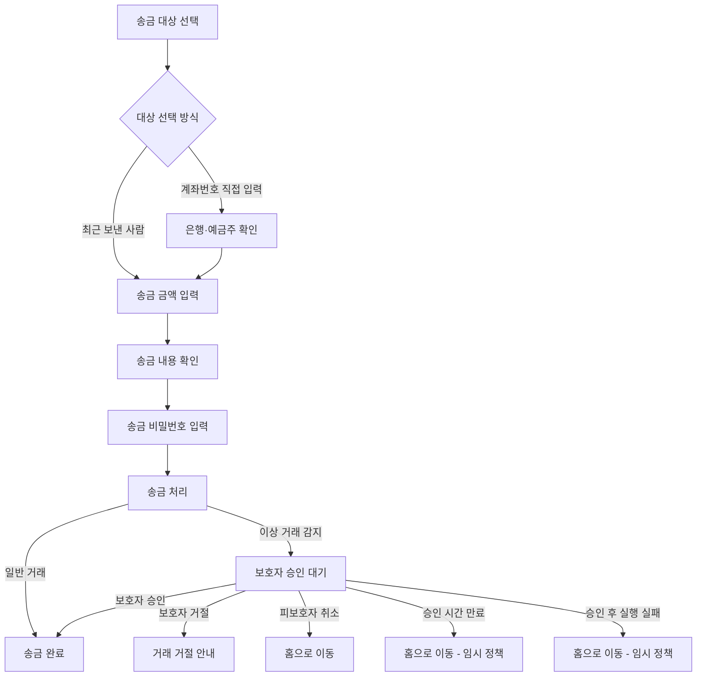
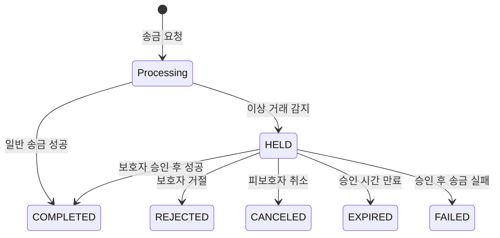

# 피보호자 송금 플로우

> 기준: 피보호자(Ward) 송금 화면의 현재 Mock 구현  
> 실제 API 연동 전이므로 응답 형식과 세부 정책은 변경될 수 있습니다.

## 1. 문서 목적

피보호자가 송금 대상을 선택한 시점부터 송금이 완료되거나 보호자 승인 대기 상태로 전환되는 과정을 설명합니다.

현재 구현 범위는 다음과 같습니다.

- 최근 보낸 사람 또는 계좌번호로 송금 대상 선택
- 은행 및 예금주 확인
- 송금 금액 입력과 최종 확인
- 송금 비밀번호 입력
- 일반 송금 완료
- 이상 거래 감지 시 보호자 승인 대기
- 승인 대기 거래로 인한 추가 송금 제한
- 보호자 거절 안내
- 승인 대기 거래 취소
- 보호자에게 전화 연결
- 새로고침과 직접 URL 접근 시 거래 상태 복구

실제 송금 API, 보호자 정보 API, 실시간 상태 조회 정책은 아직 연결하지 않았습니다.

## 2. 주요 용어

| 용어                           | 설명                                                                   |
| ------------------------------ | ---------------------------------------------------------------------- |
| 피보호자(Ward)                 | 송금 기능을 사용하는 시니어 사용자                                     |
| 보호자(Guardian)               | 피보호자의 거래를 확인하고 승인 또는 거절하는 사용자                   |
| 거래 ID(`transactionId`)       | 생성된 송금 거래를 구분하는 번호                                       |
| 요청 식별자(`Idempotency-Key`) | 같은 송금이 중복 실행되지 않도록 프런트엔드에서 생성하는 UUID          |
| 승인 대기(`HELD`)              | 이상 거래로 판단되어 보호자 확인을 기다리는 상태                       |
| 폴링(Polling)                  | 승인 결과를 확인하기 위해 일정 간격으로 거래 상태를 다시 조회하는 방식 |

## 3. 전체 사용자 흐름



### 3.1 정상 송금

1. 사용자가 최근 보낸 사람을 선택하거나 계좌번호를 직접 입력합니다.
2. 계좌번호 입력 시 가능한 은행을 먼저 불러옵니다.
3. 사용자가 은행을 선택하면 예금주를 확인합니다.
4. 송금 금액과 선택 메모를 입력합니다.
5. 받는 사람, 은행, 계좌번호, 금액을 최종 확인합니다.
6. 송금 비밀번호 6자리를 입력합니다.
7. 송금 처리 중에는 중복 요청을 막습니다.
8. 거래가 정상 완료되면 송금 완료 화면으로 이동합니다.

### 3.2 보호자 승인 대기

1. 송금 요청이 이상 거래로 판단되면 상태가 `HELD`가 됩니다.
2. 피보호자에게 거래가 잠시 중단됐다는 사실과 거래 내용을 표시합니다.
3. 화면은 3초 간격으로 거래 상태를 확인합니다.
4. 보호자가 승인하면 송금 완료 화면으로 이동합니다.
5. 보호자가 거절하면 거래 거절 안내 화면으로 이동합니다.
6. 피보호자는 대기 중인 거래를 직접 취소할 수 있습니다.

### 3.3 추가 송금 제한

승인 대기 거래가 있는 동안 새 송금을 시작하면 기존 대기 거래를 안내하는 제한 화면으로 이동합니다.

제한 화면에서는 다음 정보를 제공합니다.

- 받는 사람과 은행
- 송금 금액
- 요청 시간
- 보호자에게 전화하기
- 홈으로 이동

## 4. 화면과 라우트

| 순서 | 화면             | URL                                        | 라우트 이름                | 주요 파일                            |
| ---- | ---------------- | ------------------------------------------ | -------------------------- | ------------------------------------ |
| 1    | 송금 대상 선택   | `/ward/transfer`                           | `ward-transfer`            | `pages/ward/transfer/page.vue`       |
| 2    | 계좌번호 입력    | `/ward/transfer/account`                   | `ward-transfer-account`    | `pages/ward/transfer/account.vue`    |
| 3    | 은행 선택        | `/ward/transfer/bank`                      | `ward-transfer-bank`       | `pages/ward/transfer/bank.vue`       |
| 4    | 송금 금액 입력   | `/ward/transfer/amount`                    | `ward-transfer-amount`     | `pages/ward/transfer/amount.vue`     |
| 5    | 송금 확인        | `/ward/transfer/confirm`                   | `ward-transfer-confirm`    | `pages/ward/transfer/confirm.vue`    |
| 6    | 비밀번호 입력    | `/ward/transfer/password`                  | `ward-transfer-password`   | `pages/ward/transfer/password.vue`   |
| 7    | 송금 처리        | `/ward/transfer/processing`                | `ward-transfer-processing` | `pages/ward/transfer/processing.vue` |
| 결과 | 송금 완료        | `/ward/transfer/:transactionId/complete`   | `ward-transfer-complete`   | `pages/ward/transfer/complete.vue`   |
| 예외 | 보호자 승인 대기 | `/ward/transfer/:transactionId/held`       | `ward-transfer-held`       | `pages/ward/transfer/held.vue`       |
| 예외 | 추가 송금 제한   | `/ward/transfer/:transactionId/restricted` | `ward-transfer-restricted` | `pages/ward/transfer/restricted.vue` |
| 예외 | 보호자 거절      | `/ward/transfer/:transactionId/rejected`   | `ward-transfer-rejected`   | `pages/ward/transfer/rejected.vue`   |

라우트 등록과 화면별 진입 조건은 `src/router/index.ts`에서 관리합니다.

## 5. 송금 상태

상태 타입은 `src/types/transfer.ts`의 `TransferStatus`에 정의합니다.

| 상태        | 사용자에게 보이는 결과     | 폴링 |
| ----------- | -------------------------- | ---- |
| `HELD`      | 보호자 승인 대기 화면 유지 | 계속 |
| `COMPLETED` | 송금 완료 화면으로 이동    | 중단 |
| `REJECTED`  | 보호자 거절 안내로 이동    | 중단 |
| `CANCELED`  | 홈으로 이동                | 중단 |
| `EXPIRED`   | 홈으로 이동                | 중단 |
| `FAILED`    | 홈으로 이동                | 중단 |

`CANCELED`, `EXPIRED`, `FAILED`는 전용 디자인이 없으므로 임의 화면을 만들지 않고 홈으로 보내는 임시 정책을 적용했습니다. 전용 UI가 확정되면 `resolveTransferStatusRoute()`의 TODO를 기준으로 상태별 화면을 연결합니다.



## 6. 취소와 보호자 전화 UX

### 6.1 거래 취소

`HELD` 화면의 **거래 취소하기** 버튼을 누르면 바로 취소하지 않고 확인 모달을 표시합니다.

- 모달: `TransferCancelModal.vue`
- 확인 버튼: **거래 취소하기**
- 유지 버튼: **거래 유지하기**
- 처리 중에는 모달 닫기와 중복 클릭을 막습니다.
- 취소 성공 시 거래 상태를 `CANCELED`로 갱신하고 홈으로 이동합니다.
- 이미 보호자가 처리한 거래라면 최신 거래 상태를 다시 조회합니다.

관련 메서드:

- `useTransferStatus().cancel()`
- `cancelMockTransfer(transactionId)`

### 6.2 보호자 전화

예외 화면의 **보호자에게 연락하기** 버튼을 누르면 전화 연결 확인 모달을 표시합니다.

- 모달: `TransferGuardianCallModal.vue`
- 확인 버튼: **전화 걸기**
- 확인 시 `tel:` 링크로 연결
- 현재는 보호자 1명과 필수 연락처를 가정
- Mock 정보: `src/mocks/guardian.mock.ts`

실제 보호자 정보 API가 연결되면 `mockGuardian`을 서버 응답으로 교체해야 합니다.

## 7. 뒤로가기와 새로고침

### 7.1 뒤로가기

- 송금 완료 후 뒤로가기를 눌러도 확인·비밀번호 화면으로 돌아가 같은 송금을 다시 실행하지 않습니다.
- 완료·승인 대기·거절 화면의 헤더 뒤로가기는 홈을 기준으로 합니다.
- 상태 화면 이동에는 `router.replace()`를 사용해 오래된 상태 화면을 브라우저 기록에 쌓지 않습니다.

### 7.2 새로고침

거래 생성 이후에는 Pinia의 임시 화면 상태가 아니라 URL의 `transactionId`와 거래 상세 조회 결과를 기준으로 화면을 복구합니다.

예를 들어 `/ward/transfer/74/held`를 새로고침했을 때:

1. `transactionId` 74의 거래를 조회합니다.
2. 현재 상태가 `HELD`이면 같은 화면을 유지합니다.
3. 상태가 `COMPLETED` 또는 `REJECTED`로 변경됐다면 해당 결과 화면으로 교체 이동합니다.

현재 `/ward/transfer`로 직접 진입했을 때 서버에서 기존 대기 거래 ID를 찾는 방법은 확정되지 않았습니다. `redirectPendingTransfer`에 다음 정책 결정을 위한 TODO가 있습니다.

- 대기 거래 조회 API 추가
- 사용자 또는 지갑 응답에 `pendingTransferId` 포함
- 새 송금 요청의 `409 TRANSFER_004` 응답에서 `pendingTransferId` 수신

## 8. 중복 송금 방지

송금 요청이 확정되면 `createTransferIntent()`가 `crypto.randomUUID()`로 요청 식별자를 생성합니다.

주요 상태:

- `transferIntent`: 요청할 은행, 계좌번호, 금액, 메모, 요청 식별자
- `requestStarted`: 처리 중 중복 요청 방지
- `transferResult`: 최초 송금 요청 결과
- `transferDetail`: 거래 ID로 조회한 현재 거래 상태
- `processingStatus`: `idle`, `pending`, `held`, `unknown`, `success`, `error`

같은 송금 내용을 재시도할 때는 기존 `idempotencyKey`를 유지합니다. 입력 내용이 달라지거나 실패 후 새 송금을 시작하면 새 키를 생성합니다.

관련 파일:

- `src/stores/transfer.store.ts`
- `createTransferIntent()`
- `beginMockTransfer()`
- `confirmMockStatus()`
- `restartAfterFailure()`

## 9. 상태 조회와 폴링

`src/composables/useTransferStatus.ts`의 `useTransferStatus()`가 거래 상세 조회와 화면 이동을 담당합니다.

주요 값과 메서드:

| 이름                | 역할                           |
| ------------------- | ------------------------------ |
| `transferDetail`    | 현재 URL의 거래 상세 정보      |
| `isLoading`         | 거래 상태 조회 중 여부         |
| `isCancelling`      | 거래 취소 요청 중 여부         |
| `errorMessage`      | 조회 또는 취소 오류 안내       |
| `refresh()`         | 현재 거래 상태 다시 조회       |
| `cancel()`          | 승인 대기 거래 취소            |
| `stopPolling()`     | 상태 반복 조회 중단            |
| `syncRoute()`       | 거래 상태에 맞는 화면으로 이동 |
| `schedulePolling()` | `HELD` 상태에서 다음 조회 예약 |

현재 Mock 폴링 간격은 `pollingInterval = 3_000`, 즉 3초입니다.

- 화면 이탈 시 폴링 중단
- 브라우저 탭이 숨겨지면 폴링 중단
- 탭이 다시 보이면 즉시 조회 후 폴링 재개
- 최종 상태가 확인되면 폴링 중단

실제 API 연동 시 폴링 간격과 재시도 정책은 백엔드 정책에 맞춰 다시 결정합니다.

## 10. API 연동 예정 지점

현재 Mock 함수는 실제 API와 유사한 경계를 만들기 위한 임시 구현입니다.

| 현재 Mock                 | 향후 API                           |
| ------------------------- | ---------------------------------- |
| `submitMockTransfer()`    | `POST /ward/transfers`             |
| `getMockTransferDetail()` | `GET /ward/transfers/{id}`         |
| `cancelMockTransfer()`    | `POST /ward/transfers/{id}/cancel` |

API 연결 시 확인할 항목:

- 공통 응답 래퍼 최종 형태
- 인증 토큰 처리
- 실제 상태별 응답 필드
- 폴링 간격과 재시도 제한
- 승인 시간 만료 처리
- 보호자 정보 및 전화번호 제공 방식
- 기존 대기 거래 ID 조회 방식

## 11. Mock 확인 방법

### 11.1 비밀번호별 송금 결과

| 입력 비밀번호       | 결과                              |
| ------------------- | --------------------------------- |
| `123456` 등 일반 값 | 송금 완료                         |
| `222222`            | 이상 거래 감지 및 `HELD`          |
| `111111`            | 비밀번호 오류                     |
| `000000`            | 결과 확인이 필요한 `unknown` 상태 |

### 11.2 직접 접근 가능한 Mock 거래

| 거래 ID | 초기 상태   | 확인 용도                 |
| ------- | ----------- | ------------------------- |
| `73`    | `COMPLETED` | 완료 화면과 새로고침 복구 |
| `74`    | `HELD`      | 승인 대기·거래 제한 화면  |
| `75`    | `REJECTED`  | 보호자 거절·전화 연결     |
| `76`    | `HELD`      | 취소 확인 후 홈 이동      |

예시 URL:

```text
/ward/transfer/73/complete
/ward/transfer/74/held
/ward/transfer/74/restricted
/ward/transfer/75/rejected
/ward/transfer/76/held
```

Mock 거래와 상태 변경 함수는 `src/mocks/transfer.mock.ts`에 있습니다.

## 12. 주요 파일 구조

```text
src/
├─ composables/
│  └─ useTransferStatus.ts
├─ mocks/
│  ├─ guardian.mock.ts
│  └─ transfer.mock.ts
├─ stores/
│  └─ transfer.store.ts
├─ types/
│  └─ transfer.ts
├─ router/
│  └─ index.ts
└─ pages/ward/transfer/
   ├─ page.vue
   ├─ account.vue
   ├─ bank.vue
   ├─ amount.vue
   ├─ confirm.vue
   ├─ password.vue
   ├─ processing.vue
   ├─ complete.vue
   ├─ held.vue
   ├─ restricted.vue
   ├─ rejected.vue
   ├─ -components/
   │  ├─ TransferCancelModal.vue
   │  ├─ TransferGuardianCallModal.vue
   │  ├─ TransferExceptionDetailsCard.vue
   │  └─ TransferExceptionHero.vue
   └─ -utils/
      ├─ transfer-route-guard.ts
      └─ transfer-status-route.ts
```

## 13. 테스트 범위

### 단위 테스트

- Store 입력값과 송금 의도 생성
- 요청 식별자 재사용과 중복 요청 방지
- Mock 거래 상태 조회·변경·취소
- 상태별 목적 라우트 결정

관련 파일:

- `tests/unit/transfer.store.test.ts`
- `tests/unit/transfer.mock.test.ts`
- `tests/unit/transfer-status-route.test.ts`

### E2E 테스트

`tests/e2e/ward-transfer.spec.ts`에서 다음 사용자 흐름을 검증합니다.

- 계좌번호 입력부터 예금주 확인
- 최근 보낸 사람 연락처 추가
- 정상 송금 완료
- 승인 대기와 추가 송금 제한
- 취소 확인 모달 열기와 거래 유지
- 취소 확정 후 홈 이동
- 보호자 전화 확인과 `tel:` 연결
- 완료·거절·대기 화면 새로고침 복구
- 유효하지 않은 거래 URL 접근 차단

검증 명령:

```bash
cd fe
pnpm lint
pnpm build
pnpm test
pnpm test:e2e
```

## 14. 추후 결정이 필요한 사항

- `EXPIRED`, `FAILED`, `CANCELED` 전용 화면 디자인
- 실제 보호자 정보와 전화번호 API
- 실제 송금 생성·조회·취소 API
- 폴링 간격, 최대 재시도 횟수, 네트워크 오류 UX
- 기존 승인 대기 거래 ID 조회 방식
- 보호자 승인 결과를 폴링 외 방식(SSE, WebSocket, 푸시 후 재조회)으로 전달할지 여부
- 승인 시간 만료 시 프런트엔드와 백엔드 중 어느 쪽을 기준으로 먼저 화면을 변경할지
